# POO Peluqueria JavaFrame
Programa Peluqueria de mascotas como practica hacia la Programacion Orientado a objeto, usando como interfaz a Java Frame, MyQSL, JPA y eclipseLink

## Menu
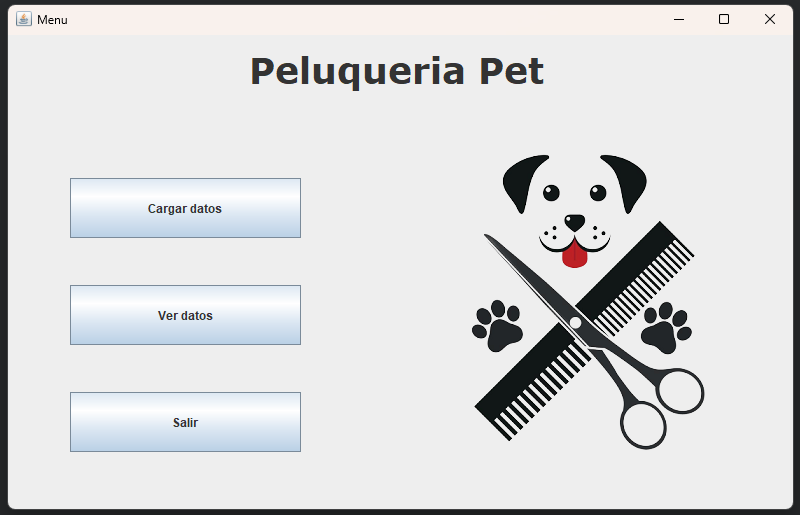

## Agregar datos
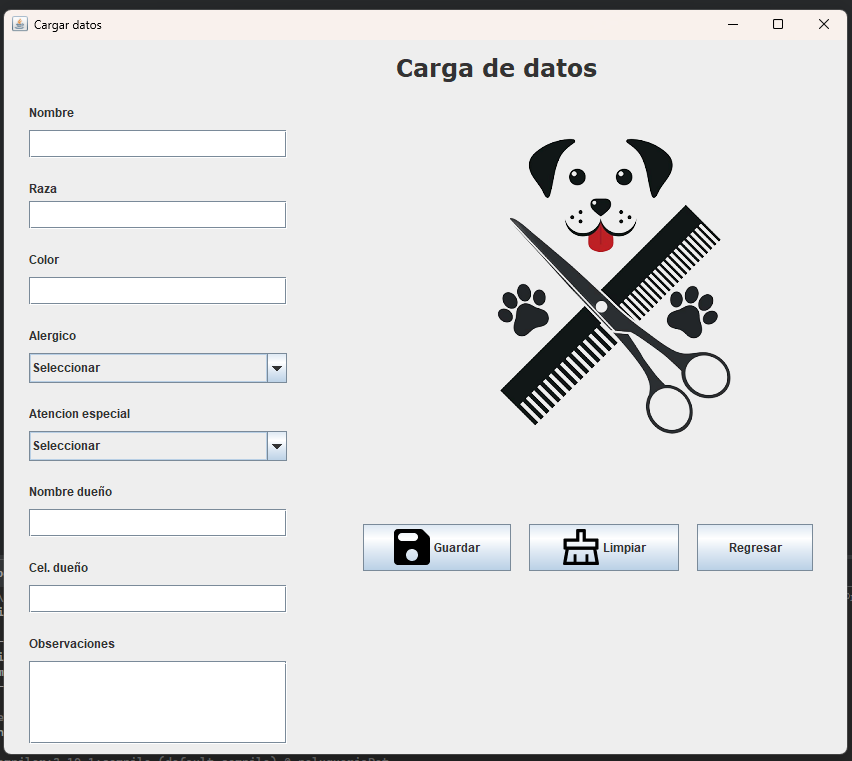
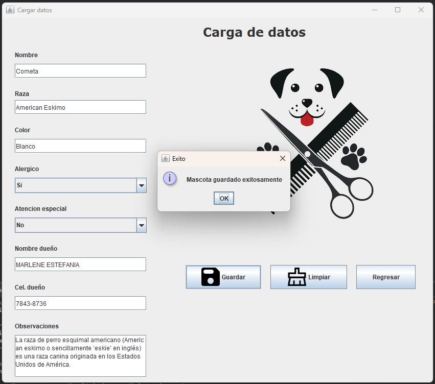

## Mostrar datos
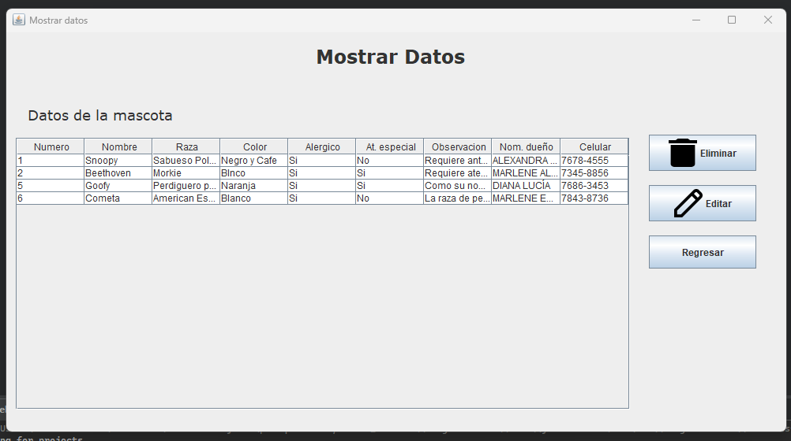

## Eliminar datos
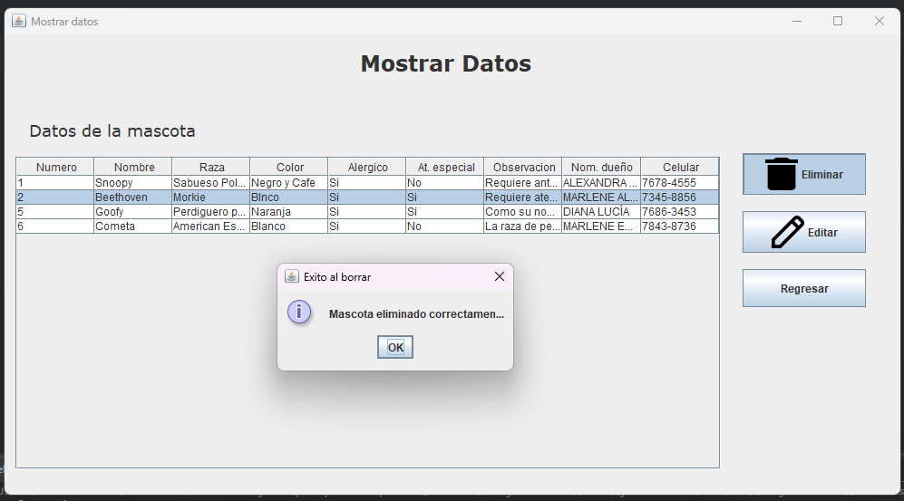
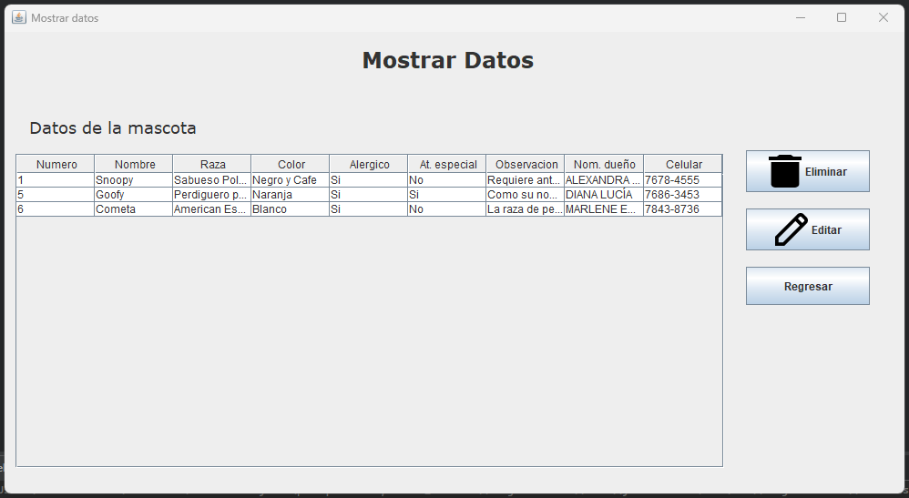

## Actualizar datos
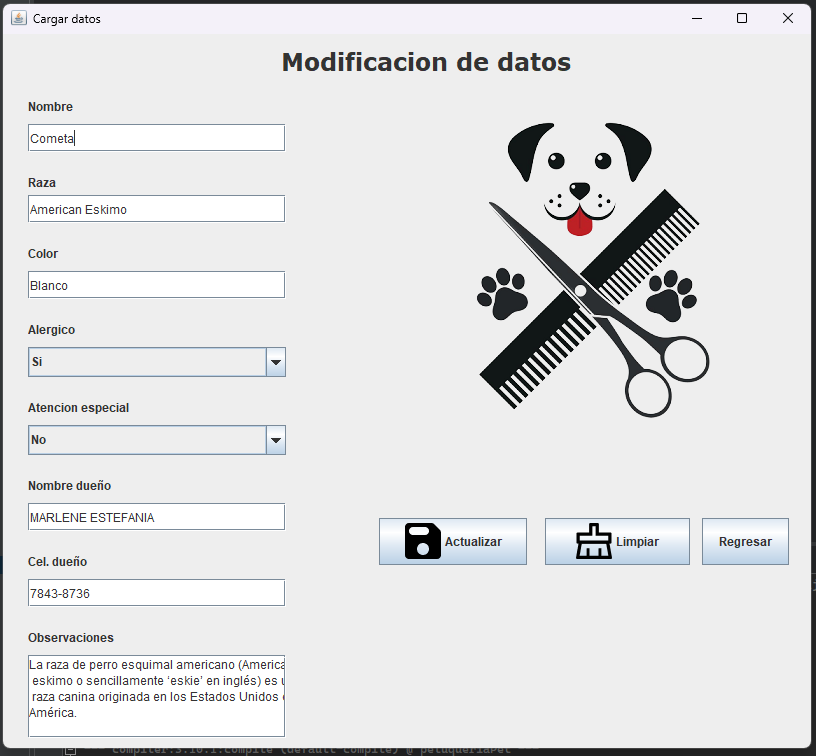
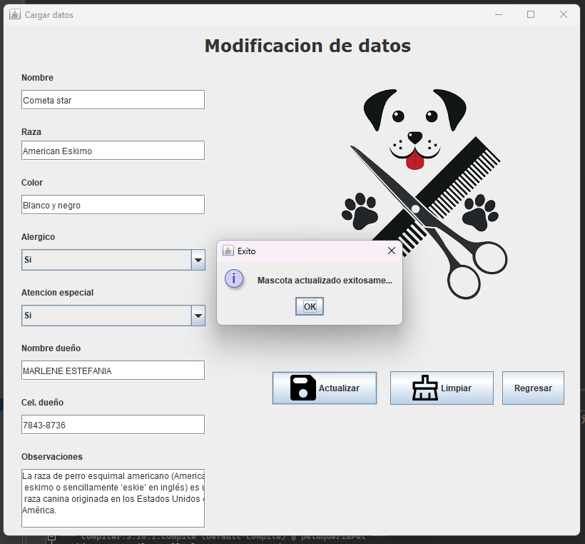
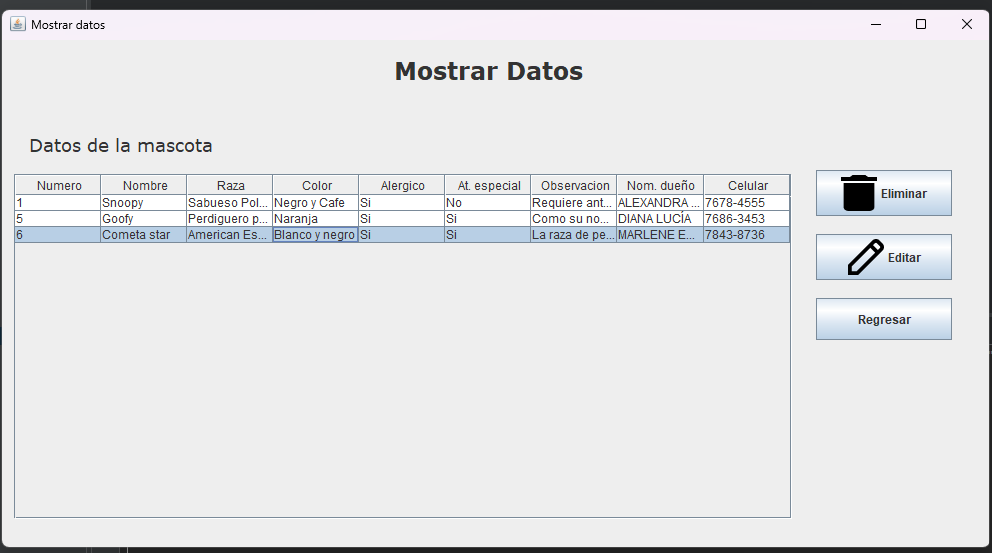

## Diagrama DER
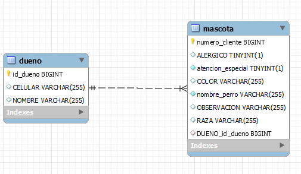

## Codigo DB
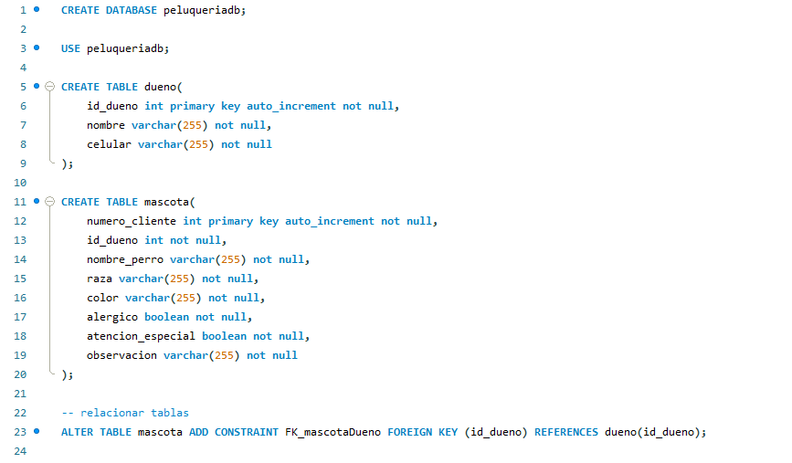

## Consultas de tablas
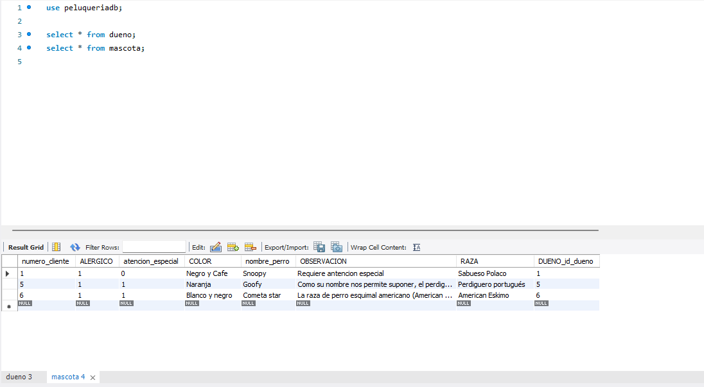
